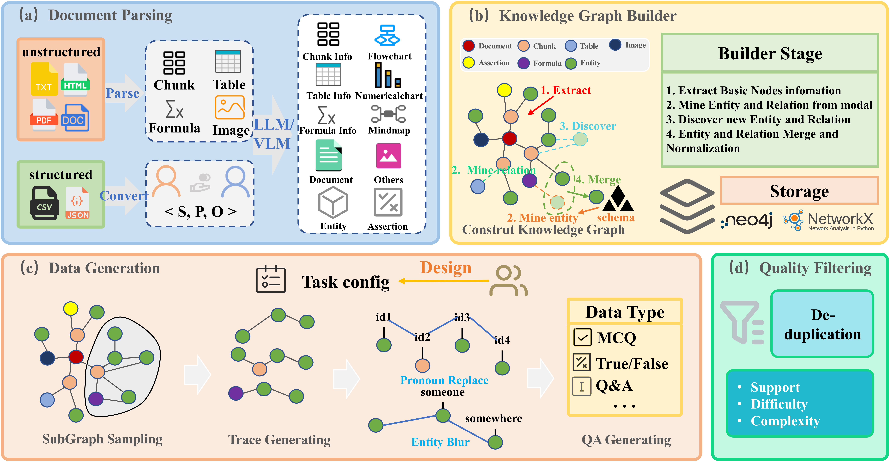
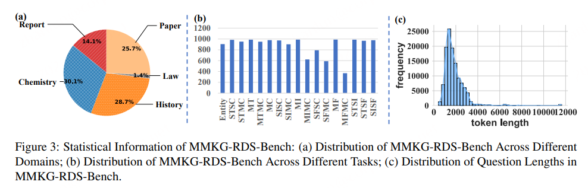

<div align="center">
  
  
  # MMKG-RDS
  
  ### 🧠 Reasoning Data Synthesis via Deep Mining of Multimodal Knowledge Graphs
  
  [](https://opensource.org/licenses/Apache-2.0)
  [](https://www.python.org/)
  [](https://github.com/360AILAB-NLP/MMKG-RDS)
  
  [English](README.md) | [中文](README_zh.md)
</div>

---

## 📖 Table of Contents

- [Overview](#-overview)
- [Key Features](#-key-features)
- [Pipeline](#-pipeline)
- [Quick Start](#-quick-start)
- [Project Structure](#-project-structure)
- [Benchmark Results](#-benchmark-results)
- [Citation](#-citation)
- [License](#-license)

---

## 🎯 Overview

Synthesizing high-quality training data is crucial for enhancing domain models' reasoning abilities. Existing methods face limitations in **long-tail knowledge coverage**, **effectiveness verification**, and **interpretability**. Knowledge-graph-based approaches still fall short in functionality, granularity, customizability, and evaluation.

To address these issues, we propose **MMKG-RDS**—a flexible framework for reasoning data synthesis that leverages multimodal knowledge graphs. It supports fine-grained knowledge extraction, customizable path sampling, and multidimensional data quality scoring.

<div align="center">
  
</div>

### 🎓 MMKG-RDS-Bench Dataset

We validate MMKG-RDS with the **MMKG-RDS-Bench** dataset:
- 🔬 **5 domains** (history, organic chemistry, law, stock research reports,and papers)
- 📝 **17 task types** 
- 📊 **14,950 high-quality samples**

**Performance Highlights**: Fine-tuning Qwen3 models (0.6B/8B/32B) on a small number of synthesized samples improves reasoning accuracy by **9.2%**. The framework also generates distinct data, challenging existing models on tasks involving tables and formulas, useful for complex benchmark construction.

---

## ✨ Key Features

<table>
  <tr>
    <td width="50%">
      <h3>📚 Data Preprocessing</h3>
      <ul>
        <li>Unified processing of <strong>structured data</strong> (JSON/CSV)</li>
        <li>Support for <strong>unstructured documents</strong> (PDF/PNG/PPT/DOC)</li>
        <li>Triplet conversion and <strong>multimodal content extraction</strong></li>
        <li>Extract text, images, tables, and formulas</li>
      </ul>
    </td>
    <td width="50%">
      <h3>🕸️ Knowledge Graph Construction</h3>
      <ul>
        <li><strong>Fully customizable schemas</strong></li>
        <li>Entity–relation constraints</li>
        <li>Complete pipeline: extraction → disambiguation → normalization</li>
        <li>Automated KG construction</li>
      </ul>
    </td>
  </tr>
  <tr>
    <td width="50%">
      <h3>💾 Flexible Storage</h3>
      <ul>
        <li>Multiple backends: <strong>Neo4j</strong>, NetworkX, JSON</li>
        <li>Seamless Neo4j integration</li>
        <li>Visualization and analytics support</li>
        <li>Export to standard formats</li>
      </ul>
    </td>
    <td width="50%">
      <h3>🎯 Reasoning Data Synthesis</h3>
      <ul>
        <li>Knowledge-graph-driven synthesis</li>
        <li><strong>Subgraph sampling</strong> and path generation</li>
        <li>Entity fuzzification for robustness</li>
        <li>Controllable QA generation with balanced difficulty</li>
      </ul>
    </td>
  </tr>
</table>

### 📊 Quality Analysis & Evaluation

- 🎚️ **Multidimensional quality assessment**: Support, difficulty, and complexity metrics
- 📈 **Fine-grained analytics**: Token distribution, task types, domain coverage
- 🔍 **Comprehensive evaluation**: Automated quality scoring and validation

---

## 🔁 Pipeline

A unified pipeline that preprocesses multimodal data, constructs customizable knowledge graphs, and synthesizes high-quality reasoning datasets with flexible storage and comprehensive quality evaluation.

<div align="center">
  
</div>

**Five-Stage Process**:
1. 📄 **Document Processing** & Knowledge Graph Construction
2. 🔬 **Data Generation** via Graph Mining
3. 🧹 **Deduplication** & Quality Scoring
4. 📤 **Data Export** to Standard Formats
5. 🎯 **Model Evaluation** & Benchmarking

---

## 🚀 Quick Start

### Prerequisites

- Python 3.8+
- LibreOffice (for document conversion)
- CUDA-compatible GPU (recommended)

### 1️⃣ Environment Setup

**Step 1: Install LibreOffice**
```bash
sudo apt-get update
sudo apt-get install libreoffice
```

**Step 2: Install Chinese Fonts** (Optional, for Chinese document processing)
```bash
# Check if Chinese fonts are installed
fc-list :lang=zh

# Copy font to system directory
sudo cp ./fonts/msyh.ttf /usr/share/fonts/
sudo fc-cache -fv
```

**Step 3: Install MinerU**
```bash
uv pip install -U "mineru[all]" -i https://mirrors.aliyun.com/pypi/simple
```

**Step 4: Install Python Dependencies**
```bash
uv pip install -U -r requirements.txt
```

### 2️⃣ Configuration Setup

Edit the configuration file `configs/dev.yaml`:
```yaml
# 非结构化数据

data:
  input_dir: ./data/dev/ud
  output_dir: ./output_dir
  output_dir: ./output_dir
  structured_data: False
  enable_visual: True

# 启用通过实体名合并实体
enable_merge_entity_by_name: true

# 启用通过实体名的相似度合并实体
enable_merge_entity_by_sim: False
merge_entity_by_sim:
  threshold: 0.95
  # embedding_model: sentence-transformers/all-MiniLM-L6-v2

# 启用通过断言的相似度合并断言
enable_merge_assertion_by_sim: true
merge_assertion_by_sim:
  threshold: 0.95
  # embedding_model: sentence-transformers/all-MiniLM-L6-v2

# 版式解析和KG抽取相关配置
dataprocessing:
  enable_assertion_recall: true
  enable_entity_recall: true
  mineru:
    server_url: http://10.178.131.48:30000

  llm:
    api_key: EMPTY
    base_url:  
      - http://10.178.141.79:8000/v1
      - http://10.178.141.233:8000/v1
      - http://10.178.133.1:8000/v1
     
    model: Qwen3-235B-A22B-Instruct-2507
    max_concurrent_requests: 256

  vlm:
    api_key: EMPTY
    base_url: http://10.178.129.197:8000/v1
    model: Qwen3-VL-2B-Instruct
    max_concurrent_requests: 24
    max_tokens: 4096

embedding_model:
  api_key: EMPTY
  base_url: http://10.178.131.43:9000/v1
  model: qwen3_embedding

# 数据合成相关配置
subgraph_sampling:
  sampling_algorithm: no_subgraph_sampling
  order: 100
  subgraph_num: 4
  kwargs:
    arg1: value1
    arg2: avlue2


trace_generation:
  selection_method: dfs
  node_types: ['Entity','Table','Image','Formula'] # ['Document','Chunk','Assertion','Entity','Table','Image','Formula']
  max_steps: 4
  num_traces: 4
  min_deg: 0
  max_deg: 200
  mode: in
  kwargs:
    arg1: value1
    arg2: avlue2


data_synthesis:
  api_key: EMPTY
  base_url:  
      - http://10.178.141.79:8000/v1
      - http://10.178.141.233:8000/v1
      - http://10.178.133.1:8000/v1
    
  model: Qwen3-235B-A22B-Instruct-2507
  task_type: multi_hop_tif
  max_concurrent_requests: 5

# QA质量过滤相关配置
evaluation_models:
  support_models:
    # 支持度评估模型列表（可以配置多个，支持多数投票）
    - model: Qwen3-VL-2B-Instruct           # 支持度评估用模型名称
      base_url: http://10.178.129.197:8000/v1  # 模型服务的 HTTP 基础地址
      api_key: EMPTY                        # 鉴权用的 API Key（本地服务可为空或固定占位）
      max_tokens: 1024                      # 单次调用允许的最大生成 token 数
    - model: Qwen3-VL-2B-Instruct           # 第二个支持度评估模型
      base_url: http://10.178.129.197:8000/v1
      api_key: EMPTY
      max_tokens: 1024
    - model: Qwen3-VL-2B-Instruct           # 第三个支持度评估模型
      base_url: http://10.178.129.197:8000/v1
      api_key: EMPTY
      max_tokens: 1024

  difficulty_models:
    # 难度评估使用的模型配置，分为 strong / weak 两个角色
    strong:
      model: Qwen3-VL-2B-Instruct           # strong模型
      base_url: http://10.178.129.197:8000/v1
      api_key: EMPTY
      max_tokens: 1024
    weak:
      model: Qwen3-VL-2B-Instruct           # weak模型
      base_url: http://10.178.129.197:8000/v1
      api_key: EMPTY
      max_tokens: 1024

  # 新增：复杂度评估使用的大模型配置
  complexity_model:
    #评估evaluate_complex的模型（负责对指令复杂度打 1~5 分）
    model: Qwen3-VL-2B-Instruct
    base_url: http://10.178.129.197:8000/v1
    api_key: EMPTY
    max_tokens: 1024

evaluation:
  batch_size: 3        # 每次并发评估的样本数量
  modes:
    - support               # 启用知识支持度评估
    - difficulty            # 启用难度评估
    - complexity            # 启用复杂度评估

  support:
    mode: majority_vote     # 支持度评估模式：majority_vote（多模型投票）或 single（单模型）
    models: [0, 1, 2]       # 使用 support_models 列表中的哪些模型（按下标选择）

  difficulty:
    mode: strong_weak       # strong_weak（强弱模型同时使用），也可设为 strong_only / weak_only

  complexity:
    enabled: true           # 是否启用复杂度评估
```

### 3️⃣ Run the Project
```bash
python main.py 
```

**Or run domain-specific examples**:
```bash
# Law domain example
python main_law.py
```

---

## 📁 Project Structure
```
MMKG-RDS/
│
├── 📄 main.py                          # Main entry point (5-stage pipeline)
├── 📄 main_law.py                      # Law domain example
├── 📄 requirements.txt                 # Python dependencies
├── 📄 README.md                        # Project documentation
│
├── 📂 assets/                          # Assets and resources
│   ├── logo.png                        # Project logo
│   ├── framwork.png                    # Framework diagram
│   └── pipeline.png                    # Pipeline visualization
│
├── 📂 config/                          # Configuration files
│   ├── dev.yaml                        # Development config
│   └── test.yaml                       # Test config
│
├── 📂 data/                            # Raw data directory
│   ├── chemistry/                      # Chemistry domain data
│   ├── law/                            # Law domain data
│   └── ...                             # Other domains
│
├── 📂 schema/                          # Schema definitions
│   ├── chemistry.schema                # Chemistry domain schema
│   └── test.schema                     # Test schema
│
├── 📂 processor/                       # Data processing modules
│   ├── processor.py                    # Main processor
│   ├── node.py                         # Node processing
│   ├── edge.py                         # Edge processing
│   ├── modal.py                        # Modal data processing
│   └── chunk.py                        # Text chunking
│
├── 📂 data_synthesis/                  # Data synthesis core
│   ├── generate_qa.py                  # QA generation
│   ├── subgraph_sampling.py            # Subgraph sampling
│   ├── trace_generate.py               # Path generation
│   ├── information_blur.py             # Entity fuzzification
│   ├── filter.py                       # Data filtering
│   └── constants.py                    # Task definitions
│
├── 📂 llms/                            # LLM clients
│   ├── client.py                       # OpenAI-compatible client
│   ├── vision_client.py                # Vision model client
│   └── emb.py                          # Embedding client
│
├── 📂 eval/                            # Evaluation modules
│   ├── eval_up.py                      # LLM evaluation
│   └── eval_up_vl.py                   # Vision-language evaluation
│
├── 📂 qafilter/                        # QA filtering
│   └── enhanced_refactored_pipeline.py # Enhanced filtering pipeline
│
├── 📂 prompts/                         # Prompt templates
│   ├── dataprocess_prompt.py           # Data processing prompts
│   ├── datasynthesis_prompt.py         # Data synthesis prompts
│   └── task_prompt.py                  # Task-specific prompts
│
├── 📂 util/                            # Utility functions
│   ├── pdf2md.py                       # PDF to Markdown
│   ├── any2pdf.py                      # Convert to PDF
│   ├── json2graph.py                   # JSON to graph
│   ├── export2std_data.py              # Export to standard format
│   └── tool.py                         # Common utilities
│
└── 📂 outputs/                         # Output directory
    ├── data_gene.json                  # Generated data
    ├── data_filter.json                # Filtered data
    ├── data_filter_statistics.json     # Statistics
    └── graph.graphml                   # Graph data
```

---

## 📊 Benchmark Results

### MMKG-RDS-Bench Data
<div align="center">
  
</div>

### Performance of Various Models Across Different Tasks

<div align="center">
  
</div>

### Fine-tuning Experiments with Synthetic Data
| Model      | Base Accuracy | Fine-tuned Accuracy | Improvement |
| ---------- | ------------- | ------------------- | ----------- |
| Qwen3-0.6B | 39.7%         | 51.5%               | **+11.8%**  |
| Qwen3-8B   | 59.0%         | 65.6%               | **+6.6%**   |
| Qwen3-32B  | 58.7%         | 67.9%               | **+9.2%**   |

---

## 📚 Citation

If you find MMKG-RDS useful in your research, please cite:
```bibtex
@article{mmkg-rds-2026,
  title={MMKG-RDS: Reasoning Data Synthesis via Deep Mining of Multimodal Knowledge Graphs},
  author={Co-authors},
  journal={arXiv preprint arXiv:2026.xxxxx},
  year={2026}
}
```

---

## 🤝 Contributing

We welcome contributions! Please see our [Contributing Guidelines](CONTRIBUTING.md) for details.

---

## 📄 License

This project is licensed under the Apache License 2.0 - see the [LICENSE](LICENSE) file for details.

---

## 🙏 Acknowledgments

- Built with [MinerU](https://github.com/opendatalab/MinerU) for document processing
- Knowledge graph storage powered by [Neo4j](https://neo4j.com/)
- LLM integration via [OpenAI API](https://openai.com/)

---

<div align="center">
  
  **⭐ Star us on GitHub — it motivates us a lot!**
  
  [Report Bug](https://github.com/360AILAB-NLP/MMKG-RDS/issues) · [Request Feature](https://github.com/360AILAB-NLP/MMKG-RDS/issues) · [Documentation](https://mmkg-rds.readthedocs.io/)
  
</div>